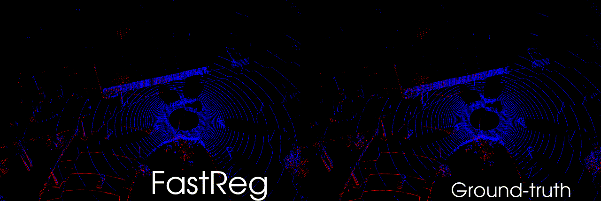
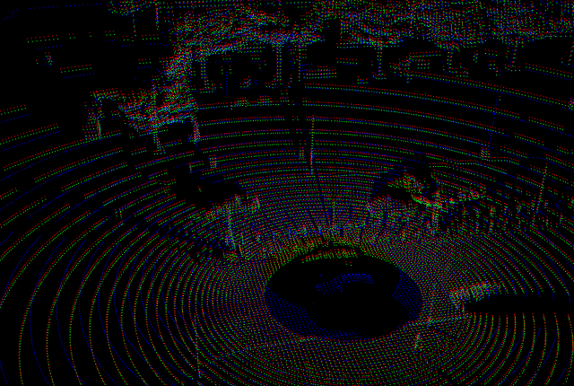
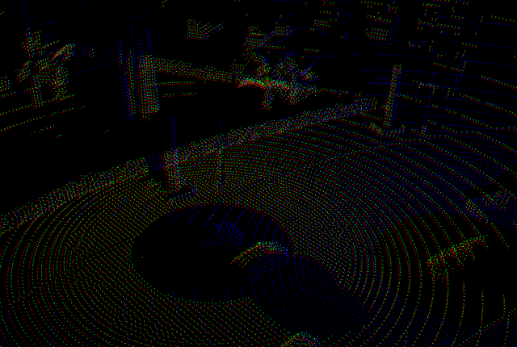
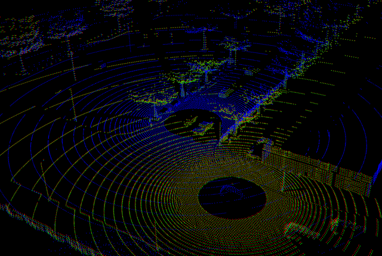

# Fast and Robust Registration of Partially Overlapping Point Clouds

[Paper](https://ieeexplore.ieee.org/document/9662220) | [Preprint](https://arxiv.org/abs/2112.09922) | [Dataset](https://github.com/eduardohenriquearnold/CODD) 



If you use any parts of this code or dataset, please cite
```
@article{arnold2021fastreg,
  author={Arnold, Eduardo and Mozaffari, Sajjad and Dianati, Mehrdad},
  journal={IEEE Robotics and Automation Letters},
  title={Fast and Robust Registration of Partially Overlapping Point Clouds},
  year={2021},
  volume={},
  number={},
  pages={1-8},
  doi={10.1109/LRA.2021.3137888}
}
```

## :gear: Installation

### Dependencies
This repository requires a CUDA capable device.
Please install the dependencies using conda and activate the environment:
```
conda env create -f environment.yml
conda activate fastreg
```
This code was tested on Ubuntu 18.04 with CUDA 10.2, Python 3.7.9 and PyTorch 1.7.1.

### Compile and Install PointNet++ CUDA kernels
```
cd lib/pointnet2/
python setup.py install
```
Note that this requires the CUDA toolkit to be installed, check if this is the case with `nvcc --version`. 

### Download datasets
- Download the [KITTI Odometry (laser-data)](http://www.cvlibs.net/datasets/kitti/eval_odometry.php) dataset
- Download the [CODD](https://github.com/eduardohenriquearnold/CODD) dataset
- Extract the datasets into separate folders and write the **absolute** path to each dataset in `config.py`.

## :woman\_teacher: Training
Pre-trained models on the CODD and KITTI dataset are provided in `assets/`. But one can start training fastreg from scratch using:
```
python train.py DATASET
```
where `DATASET` is either `codd` or `kitti`.

To resume training from a checkpoint (reload only model weights, not optimiser state), add the option `--checkpoint PATH_TO_CHECKPOINT`

Additional training parameters, such as learning-rate, batch size, etc., can be set-up in the `config.py` file.

The training progress can be observed in tensorboard loaded from the folder `runs/`. 
The model weights are saved into `runs/modelX.pth` after each epoch, where `X` is the respective epoch.

## :chart: Evaluation
Evaluate the model using:
```
python eval.py MODEL DATASET --checkpoint PATH_TO_SAVED_WEIGHTS
```

For example, to evaluate `fastreg` on the `CODD` and `KITTI` datasets usingg the respective model weights, use:
```
python eval.py fastreg codd --checkpoint assets/fastreg-codd-checkpoint.pth
python eval.py fastreg kitti --checkpoint assets/fastreg-kitti-checkpoint.pth
```

We also provide the evaluation of FastReg using ICP refinement by replacing `fastreg` by `fastregicp` in the above commands.
Note that some baseline models are also provided, please see all available models using `python eval.py -h`.

The evaluation results (containing translation and rotation errors for every sample) are stored into a pth file in `results/`.
After running the evaluation script on all desired models/datasets, visualise the results table and plots using:
```
python plot.py
```
This script plots the cumulative distribution of the translation/rotation errors and execution times for methods in each dataset in the respective files: `results/plots-kitti.png` and `results/plots-codd.png`.

## :telescope: Visualisation
To visualise the point clouds and correspondences for a given set of frames, use:
```
python vis.py MODEL DATASET --checkpoint PATH_TO_SAVED_WEIGHTS --frames 1,2,3
```

- <font color='#4275f5'>Blue points:</font> target point cloud
- <font color='red'>Red points:</font> source point cloud transformed using the models' estimated transformation
- <font color='green'>Green points:</font> source point cloud transformed using the ground-truth transformation

Ideally, we want the <font color='red'>red</font> and <font color='green'>green</font> points to match perfectly. If you are seeing yellow points it's because this is close to happening!

The snapshots below were created using 
```
python vis.py fastreg codd --checkpoint assets/fastreg-codd-checkpoint.pth --frames 43,552,901
```





## :octocat: Acknowledgements
- PointNet++ layer implementations from [sshaoshuai](https://github.com/sshaoshuai/Pointnet2.PyTorch)
- GNN layers from [PyG](https://pytorch-geometric.readthedocs.io/en/latest/)
- KITTI dataloader inspired by [DGR](https://github.com/chrischoy/DeepGlobalRegistration)
